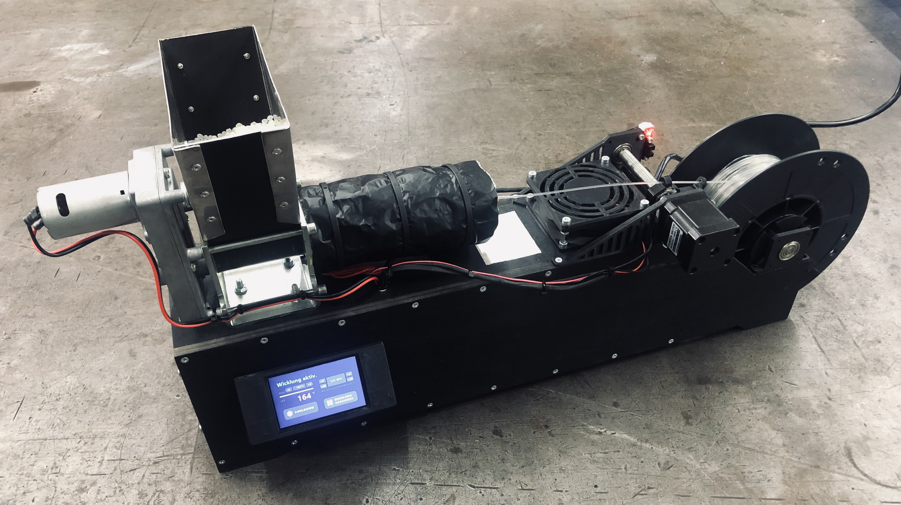

# Filament-Extruder <!-- omit in toc -->

Bachelorprojekt im Studiengang Mechatronik, HAW Hamburg.  
*Entwickelt von Tobias Freytag, Anton Neike, Max Sahlke, Lukas Wiesehan.  
Betreut von Prof. Dr. Dietmar Pähler.*

###### Inhalt <!-- omit in toc -->
- [Einführung](#einführung)
- [Repo-Struktur](#repo-struktur)
- [Hardware](#hardware)
  - [Bestellliste](#bestellliste)
  - [Verdrahtung des Systems](#verdrahtung-des-systems)
    - [Arduino Mega](#arduino-mega)
    - [Arduino Nano](#arduino-nano)
    - [Mosfet-Module](#mosfet-module)
    - [Heizpatronen](#heizpatronen)
    - [PT100 Signalverstärker](#pt100-signalverstärker)
    - [PT100 Temperatursensor](#pt100-temperatursensor)
    - [Relais-Modul](#relais-modul)
    - [Extruder Motor](#extruder-motor)
    - [Filament-Lüfter](#filament-lüfter)
    - [Schrittmotortreiber](#schrittmotortreiber)
    - [Schrittmotoren](#schrittmotoren)
    - [Optischer Endschalter](#optischer-endschalter)
- [Software](#software)
- [Konfiguration des Systems](#konfiguration-des-systems)
- [Bedienung des Systems](#bedienung-des-systems)
        - [Extruder im Prozess](#extruder-im-prozess)

## Einführung

Im Rahmen des Bachelorprojekts im 5. Semester des Bachelorstudiengangs Mechatronik an der HAW Hamburg soll eine Anlage konstruiert und realisiert werden, 
die aus Kunststoffgranulat 3D-Druck Filament extrudiert und dieses auf entsprechende Rollen aufspult. Übergeordnetes Ziel ist es, Prototypen oder 
fehlgeschlagene Druckteile zu schreddern, um sie erneut zu Filament zu extrudieren und dieses erneut zu verwenden. Da sowohl die Qualität des Kunststoffs, als
auch die Verarbeitbarkeit unter häufigem Aufschmelzen leiden, soll das mit der Anlage hergestellte Filament lediglich für den Druck von Prototypen verwendet
werden.

###### Funktionsschema <!-- omit in toc -->

Die im Funktionsschema grün dargestellten Elemente sind Teil dieses Projekts. Die Konstruktion eines Schredders ist im Rahmen dieses Projekts nicht möglich, allerdings
kann das System in Folgeprojekten durchaus mit einem Schredder erweitert werden, der auf den Trichter des Extruders aufgesetzt werden sollte.

## Repo-Struktur

Das Stammverzeichnis des Repositorys beinhaltet alles, was für eine Rekonstruktion des Systems notwendig ist. Es teilt sich in folgende Unterverzeichnisse auf.

| Verzeichnis | Inhalt |
|---|---|
| [`/arduino`](/arduino/filamentextruder) | Arduino-Projekt, Liste der notwendigen Libraries, Anleitung zur notwendigen Modifikation der Nextion-Library |
| [`/cad`](/cad) | CAD-Modell des fertigen Systems, `.stl`-Dateien der gedruckten Einzelteile |
| [`/hmi`](/hmi) | `.HMI`-Datei und Anleitung zur Installation des Interfaces auf dem Nextion Display, Screenshots des Interfaces |

Die hier abgelegten Daten entsprechen dem finalen Entwicklungsstand des Systems. Die **ausführliche Projektdokumentation**, in der die einzelnen Entwicklungsschritte 
während des Projekts näher ausgeführt sind, ist als [Wiki dieses Repos](https://github.com/lukaswiesehan/filamentextruder/wiki) realisiert.

## Hardware

Nachfolgend werden alle Komponenten aufgelistet, die bestellt werden müssen. Gehäuse- und Druckteile sind in [`/cad`](/cad) abgelegt und können auf unterschiedliche Weise gefertigt 
werden, weshalb sie in der Kostenaufstellung nicht berücksichtigt werden. Zudem werden Kabel zur Verdrahtung des Systems benötigt, die hier ebenfalls nicht aufgelistet sind.

### Bestellliste

| Anzahl | Bezeichnung | Beschreibung | Preis |
|:---:| --- | --- |:---:|
| 1x | [Felfil Evo Basic Kit](https://felfil.com/shop/felfil-evo-basic-kit/?v=5ea34fa833a1) | Basiskomponenten des Extruders als Bausatz | 299,00€ |
| 1x | [Kaltgerätebuchse](https://www.amazon.de/Hifi-Lab-Einbau-Stecker-Einbau-Buchse-Kaltger%C3%A4te-Buchse/dp/B01H5MK3OI) | Spannungsversorgung des Systems | 6,39€ |
| 1x | [Kaltegeräte-Anschlusskabel](https://www.conrad.de/de/p/hawa-1008230-kaltgeraete-anschlusskabel-schwarz-2-00-m-621535.html) | Spannungsversorgung des Systems | 4,86€ |
| 1x | [Netzteil 24V 320W](https://www.conrad.de/de/p/mean-well-rsp-320-24-ac-dc-netzteilbaustein-geschlossen-13-4-a-321-6-w-24-v-dc-1293056.html) | Primäre Spannungsquelle des Systems | 62,38€ |
| 1x | [Spannungswandler XL4016](https://www.az-delivery.de/products/xl4016-step-down-buck-converter-dc-dc?_pos=5&_sid=a325961b4&_ss=r) | Spannungsversorgung der 12V-Komponenten (Extrudermotor & Lüfter) | 8,49€ |
| 1x | [Spannungswandler LM2596S](https://www.az-delivery.de/products/lm2596s-dc-dc-step-down-modul-1?_pos=6&_sid=619fecdd6&_ss=r) | Spannungsversorgung der 5V-Komponenten (Display & Arduino) | 5,29€ |
| 3x | [Mosfet Modul IRF520](https://www.az-delivery.de/products/irf520-mos-driver-modul-0-24v-5a?_pos=1&_sid=0db666f69&_ss=r) | Steuerung der Heizpatronen | 4,29€ |
| 3x | [Heizpatrone 24V](https://www.conrad.de/de/p/24v-40w-heizpatrone-j-head-hotend-heater-cartridge-3d-drucker-802287254.html) | Heizmodule des Extruders | 4,50€ |
| 1x | [Temperatursensor PT100](https://www.conrad.de/de/p/heraeus-nexensos-w-eyk-6-pt100-platin-temperatursensor-40-bis-500-c-100-3850-ppm-k-172412.html) | Sensor zur Bestimmung der Extrudertemperatur | 15,03€ |
| 1x | [Adafruit MAX31865](https://www.conrad.de/de/p/adafruit-pt1000-rtd-temperature-sensor-amplifier-max31865-802235187.html) | Modul zur Wandlung des Sensorsignals des PT100 | 19,33€ |
| 2x | [Schrittmotortreiber SMD356C](https://www.conrad.de/de/p/waveshare-smd356c-three-phase-hybrid-stepper-motor-driver-806805951.html) | Steuerung der Wicklungsmotoren | 41,44€ |
| 2x | [Schrittmotor NEMA-17](https://www.conrad.de/de/p/joy-it-schrittmotor-nema-17-01-nema-17-01-0-4-nm-1-68-a-wellen-durchmesser-5-mm-1597325.html) | Antriebe des Wicklungsmechanismus | 27,20€ |
| 1x | [Nextion Display NX4024K032](https://www.amazon.de/MakerHawk-Nextion-NX4024K032-erweiterte-Versionen/dp/B072FN3SFH/) | Anzeige und Touch-Interface zur Steuerung des Systems | 38,44€ |
| 1x | [Arduino Mega](https://www.az-delivery.de/products/mega-2560-r3-board-mit-atmega2560-100-arduino-kompatibel-ohne-usb-kabel?_pos=15&_sid=7e3e6e2d1&_ss=r) | Steuerung des Extruder-Systems und des HMI | 13,79€ |
| 1x | [Arduino Nano](https://www.az-delivery.de/products/nano-v3-mit-ch340-arduino-kompatibel) | Steuerung des Wicklungsmechanismus | 6,49€ |
| 1x | [Relais-Modul KY-019](https://www.az-delivery.de/products/relais-modul) | Schalten des Extrudermotors | 4,99€ |
| 1x | [Optischer Endschalter](https://www.amazon.de/Homyl-Optischer-Begrenzungsschalter-Endanschlag-Werkzeuge-Rot/dp/B07MHFTVNF/) | Referenzierung des Führungsmotors | 2,51€ |
| 2x | [PC-Lüfter 80x80x25](https://www.conrad.de/de/p/logilink-fan101-pc-gehaeuse-luefter-schwarz-b-x-h-x-t-80-x-80-x-25-mm-871001.html) | Kühlung elektronischer Bauteile und des Filaments | 4,18€ |

Die Hardware-Kosten summieren sich damit auf **649,02€** zzgl. diverser Versandkosten sowie der Gehäuse- bzw. Druckteile.

### Verdrahtung des Systems

###### Verdrahtung <!-- omit in toc -->

Im oben abgebildeten Schema wurde folgende Farbkonvention eingehalten:
- Schwarz: GND
- Rot: 5-12V VCC
- Orange: 24V VCC
- Blau, Grün, Gelb, Lila: Daten/Signale

*Hinweis: Das Nextion Display wurde im Schema durch ein ähnliches Display ersetzt,
welches sich sowohl im Maßstab, als auch in der Pin-Belegung unterscheidet.*

*Hinweis: Es ist darauf zu achten, dass alle Elemente des Systems auf das selbe `GND`-Niveau gelegt sind.*

#### Arduino Mega

Der Arduino Mega dient als primärer Prozessor des Systems, auf dem die Temperaturregelung
und die Displaysteuerung implementiert sind. Er wird an `GND` und `12 V` Versorgungsspannung angeschlossen.

#### Arduino Nano

Der Arduino Nano wird für die Steuerung des Wicklungsmechanismus benötigt, da die Ansteuerung
der Schrittmotoren eine Signalfrequenz benötigt, die auf dem Mega wegen der darauf laufenden 
Temperaturregelung nicht gewährleistet werden kann. Der Nano wird zur Versorgung ebenfalls
an `GND` und `12 V` angeschlossen. Zudem wird der Hardware-Serial des Nanos mit den Pins `TX`
und `RX` an `RX1` und `TX1` des Mega, also dessen Hardware-Serial 1 verbunden, sodass eine
Kommunikation zwischen den beiden Arduinos implementiert werden kann.

#### Mosfet-Module

Die drei Mosfet-Module werden jeweils `GND` und `24 V` Versorgungsspannung angeschlossen.
Für die Ansteuerung werden `GND` und `VCC` mit dem `5 V` Ausgang und `SIG` mit je einem 
PWM-Ausgang (hier Pins `1`, `2` und `3`) des Arduino Mega verbunden. 

#### Heizpatronen

Die Heizpatronen werden jeweils an die beiden Ausgangs-Terminals der Mosfet-Module angeschlossen. Die Polarität spielt hierbei keine Rolle.

#### PT100 Signalverstärker

Das Adafruit-Modul MAX31865 zum Auslesen des PT100-Sensors wird an `GND` und `5 V` Versogungsspannung angeschlossen. Zur Übertragung der Temperatur an den Arduino Mega werden
die Pins `CS`, `DI`, `DO` und `CLK` an vier Digital-Pins (hier Pins `45`, `47`, `49` und `51`) des Mega angeschlossen.

#### PT100 Temperatursensor

Der PT100 Sensor wird an das Sensorterminal des Adafruit MAX31865 angeschlossen. Da es sich
um einen PT100 mit zwei Kabeln handelt, werden die mittleren beiden Anschlüsse des Moduls
verwendet.

Zur Verwendung des Moduls und des PT100 in Kombination mit einer entsprechenden
Arduino-Library findet sich auf der [Adafruit-Website](https://learn.adafruit.com/adafruit-max31865-rtd-pt100-amplifier/arduino-code) ein umfangreiches Tutorial.

#### Relais-Modul

Das Relais-Modul KY-019 soll zur Steuerung des Extruder-Motors verwendet werden, weshalb an 
den `COM`-Port `12 V` Versorgungsspannung angelegt wird. An der Signalseite wird das Modul
mit `GND` und `5 V` versorgt. Der `SIG`-Pin wird an einen Digitalpin (hier Pin `53`) des Arduino Mega angeschlossen. 

#### Extruder Motor

Der Extruder-Motor wird am Negativ-Pol mit `GND` verbunden, während der Positiv-Pol auf den
`NO`-, also "Normally Open"-Ausgang des Relais-Moduls gelegt wird.

#### Filament-Lüfter

Da der Lüfter zur Kühlung des Filaments nur benötigt wird, sofern extrudiert wird, wird er
analog zum Extruder-Motor mit `GND` versorgt und mit dem Positiv-Pol an das `NO`-Terminal
des Relais-Moduls angeschlossen.

#### Schrittmotortreiber

Die Schrittmotortreiber werden jeweils mit `GND` und `24 V` versorgt. Die `GND`-Leitung kann zudem jeweils direkt mit auf `PUL-` und `DIR-` der Signalterminals gelegt werden. `PUL+` und
`DIR+` werden an jeweils einen Digitalpin des Arduino Nano angeschlossen. Der Wicklungsmotor
ist hier an `10` und `9`, der Führungsmotor an `12` und `11` angeschlossen.

*Wichtig: die Schrittmotortreiber müssen mit den 6 Schaltern auf folgende Konfiguration eingestellt werden.*

| S1 | S2 | S3 | S4 | S5 | S6 |
|:-:|:-:|:-:|:-:|:-:|:-:|
| 0 | 0 | 0 | 1 | 1 | 0 |

#### Schrittmotoren

Die Schrittmotoren werden jeweils an `A-`, `A+`, `B-` und `B+` der Motortreiber angeschlossen. Die genaue Belegung kann vom Schrittmotor abhängig sein, daher wird an 
dieser Stelle auf [dieses Tutorial](https://www.makerguides.com/tb6600-stepper-motor-driver-arduino-tutorial/) verwiesen, in dem beschrieben wird, wie die
die korrekte Belegung der Schrittmotoren bestimmt werden kann.

#### Optischer Endschalter

Der optische Endschalter wird an `GND` und `5 V` Versorgungsspannung angeschlossen und mit
dem `S`- bzw. Signal-Pin auf einen Digitalpin (hier Pin `13`) des Arduino Nano gelegt.

## Software

Die Software besteht aus zwei Komponenten, die sich im Ordner [`/arduino`](/arduino) befinden.
Die genauen Funktionsweisen der Codes können den zugehörigen README-Dateien entnommen werden. 
Wie im Bereich *Hardware* bereits angedeutet, wird das Arduino-Projekt [`filamentextruder`](/arduino/filamentextruder) auf den Arduino Mega und das Projekt [`motorsteuerung`](/arduino/motorsteuerung) auf den Arduino Nano hochgeladen.

## Konfiguration des Systems

Um einen optimalen Prozess zu gewährleisten, sollten vor Inbetriebnahme einige Dinge beachtet werden.

Je nach thermischer Isolation des Extruders werden sich die Reglerparameter ein wenig unterscheiden. Da das System verhältnismäßig träge ist,
stellt das kein großes Problem dar. Um den Aufheizvorgang hinsichtlich seiner Dauer und Genauigkeit zu optimieren, sollten die PID-Parameter
dem System entsprechend eingestellt werden. Wie dazu vorgegangen werden sollte, kann dem Wiki-Kapitel [Entwicklung/Temperaturregelung](https://github.com/lukaswiesehan/filamentextruder/wiki/Entwicklung#temperaturregelung) entnommen werden. Die bestimmten Reglerparameter können dann in [`filamentextruder.ino`](/arduino/filamentextruder/filamentextruder.ino#L40) aktualisiert werden.

Weiterhin sollte die Basis-Geschwindigkeit der Wicklung an den Extruder angepasst werden, obwohl sie durch die Verwendung des selben mitgelieferten Motors
nur unwesentlich unterscheiden sollte. Im Wiki-Kapitel [Entwicklung/Wicklungsmechanismus](https://github.com/lukaswiesehan/filamentextruder/wiki/Entwicklung#wicklungsmechanismus)
wird ausführlich beschrieben, wie der Parameter `EXTRUSION_FEED` an das System angepasst werden sollte, um einen optimalen Filamentdurchmesser nach der Extrusion
zu gewährleisten. Dieser Parameter wird anschließend in [`motorsteuerung.ino`](/arduino/motorsteuerung/motorsteuerung.ino#L11) aktualisiert.

## Bedienung des Systems

###### Extruder im Prozess

tbd.
