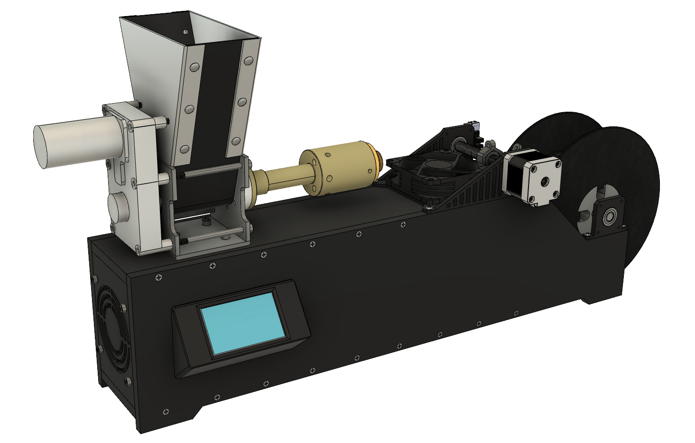
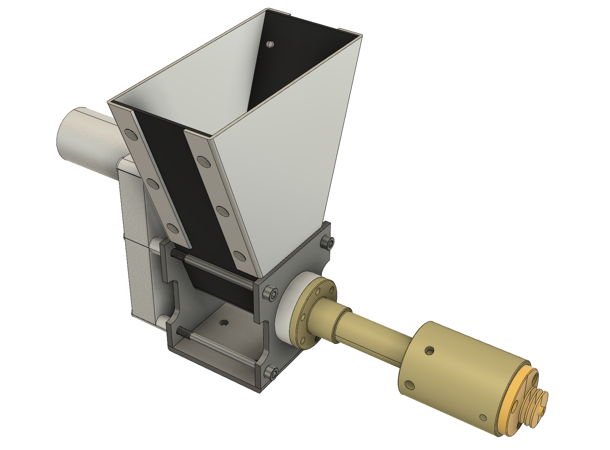

# Konstruktion & CAD <!-- omit in toc -->

###### Inhalt <!-- omit in toc -->
- [Zeichnungen](#zeichnungen)
  - [Gehäuse](#gehäuse)
  - [Einfülltrichter](#einfülltrichter)
- [Druckteile](#druckteile)

## Zeichnungen

### Gehäuse

Das Gehäuse des Systems kann ausschließlich aus `10 mm` starkem Sperrholz hergestellt werden. Die notwendigen
Zeichnungen sind im Verzeichnis [`/zeichnungen`](/zeichnungen) abgelegt. Die Gehäusekomponenten sind im folgenden
Rendering schwarz eingefärbt.

###### Rendering des Gesamtsystems <!-- omit in toc -->

Das Gehäuse besteht im wesentlichen aus vier Platten die zu einem Kasten zusammengeschraubt werden, auf den Extruder
und Wicklungsmechanismus aufgesetzt werden. Die Elektronischen Komponenten können an der Innenseite der Vorderseite
montiert und verkabelt werden. Die linke Seite des Gehäuses, in die der Lüfter eingelassen ist, wird zusätzlich
3D-gedruckt.

| Dokument | Beschreibung |
|---|---|
| [`001_rückseite.pdf`](/zeichnungen/001_rückseite.pdf) | Rückseite des Gehäuses mit Aussparung für die Kaltgerätebuchse. An diese Seite wird von innen das Netzteil montiert. |
| [`002_vorderseite.pdf`](/zeichnungen/002_vorderseite.pdf) | Vorderseite des Gehäuses mit Aussparung für das Display. An diese Seite werden von innen alle elektronischen Komponenten montiert. |
| [`003_unterseite.pdf`](/zeichnungen/003_unterseite.pdf) | Unterseite des Gehäuses. |
| [`004_oberseite.pdf`](/zeichnungen/004_oberseite.pdf) | Oberseite des Gehäuses. Auf diese Seite wird der Extruder selbst montiert. |

### Einfülltrichter

Zum Betrieb der Anlage wird außerdem ein Einfülltrichter für das Rohmaterial benötigt, da der Lieferumfang des
Extruder-Bausatzes keinen beinhaltet. Hier wurde ein Trichter konstruiert, der aus `2 mm` starkem Aluminium-Blech
hergestellt werden kann.

###### Einfülltrichter <!-- omit in toc -->

Der Einfülltrichter besteht aus einem Bodenblech und zwei Seitenblechen, die jeweils um 90° abgekantet werden, um
mit dem Bodenblech vernietet zu werden. Eines der Seitenbleche weist zusätzlich zwei Bohrungen auf, an denen der
Trichter am Getriebegehäuse des Extrudermotors fixiert werden kann.

| Dokument | Beschreibung |
|---|---|
| [`005_trichter_seite1.pdf`](/zeichnungen/005_trichter_seite1.pdf) | Im Rendering sichtbare Vorderseite des Trichters. |
| [`006_trichter_seite2.pdf`](/zeichnungen/006_trichter_seite2.pdf) | Rückseite des Trichters. Mit zwei Bohrungen zur Fixierung des Trichters am Getriebegehäse versehen. |
| [`007_trichter_boden.pdf`](/zeichnungen/007_trichter_boden.pdf) | Bodenblech des Trichters, das wesentlich für den Einlauf des Rohmaterials zur Schnecke sorgt. |

## Druckteile

Neben Gehäuseteilen und Einfülltrichter werden zum vollständigen Aufbau des Systems einige Druckteile benötigt. 
Diese sind im Wesentlichen im Bereich des Wicklungsmechanismus verbaut. Alle Druckteile sind als `.stl`-Files im
Verzeichnis [`/prints`](/prints) abgelegt und der Übersicht halber nachfolgend abgebildet.

| Druckdatei | Abbildung |
|---|---|
| [`führung_basis.stl`](/prints/führung_basis.stl) |  |
| [`führung_positionierer.stl`](/prints/führung_positionierer.stl) |  |
| [`führung_sensorhalter.stl`](/prints/führung_sensorhalter.stl) |  |
| [`gehäuse_displayrahmen.stl`](/prints/gehäuse_displayrahmen.stl) |  |
| [`gehäuse_seite_lüfter.stl`](/prints/gehäuse_seite_lüfter.stl) |  |
| [`wicklung_lageraufnahme.stl`](/prints/wicklung_lageraufnahme.stl) |  |
| [`wicklung_motoraufnahme.stl`](/prints/wicklung_motoraufnahme.stl) |  |
| [`wicklung_spulenaufnahme.stl`](/prints/wicklung_spulenaufnahme.stl) |  |